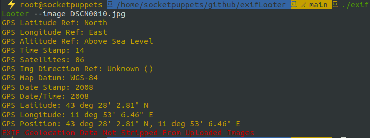
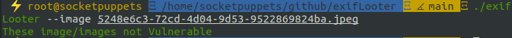
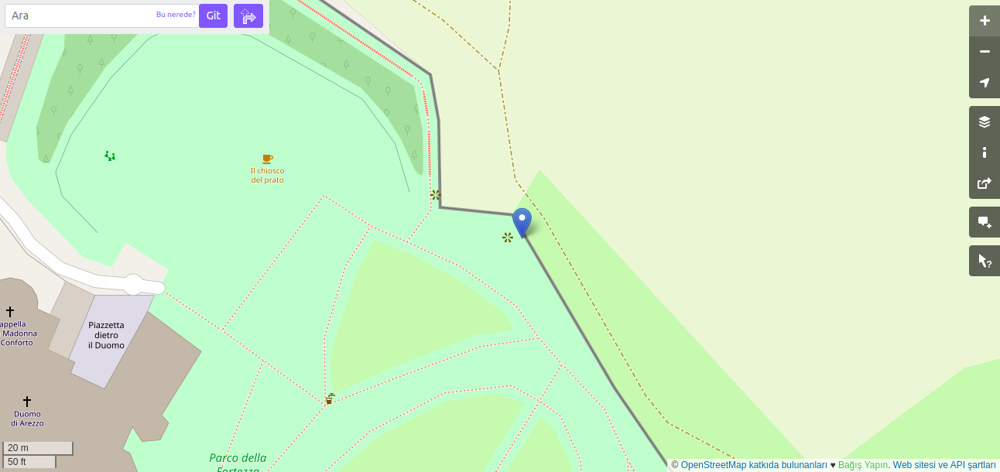
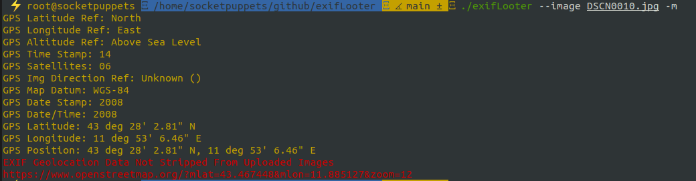
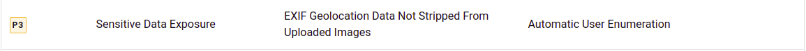

[![Contributors][contributors-shield]][contributors-url]
[![Forks][forks-shield]][forks-url]
[![Stargazers][stars-shield]][stars-url]
[![Issues][issues-shield]][issues-url]
[![MIT License][license-shield]][license-url]
[![LinkedIn][linkedin-shield]][linkedin-url]


<!-- PROJECT LOGO -->
<br />
<p align="center">
  <a href="https://github.com/aydinnyunus/exifLooter">
  </a>

<h3 align="center">Exif Looter</h3>

  <p align="center">
    <br />
    <a href="https://github.com/aydinnyunus/exifLooter"><strong>Explore the docs »</strong></a>
    <br />
    <br />
    ·
    <a href="https://github.com/aydinnyunus/exifLooter/issues">Report Bug</a>
    ·
    <a href="https://github.com/aydinnyunus/exifLooter/issues">Request Feature</a>
  </p>
</p>


<!-- TABLE OF CONTENTS -->
<details open="open">
  <summary>Table of Contents</summary>
  <ol>
    <li>
      <a href="#getting-started">Getting Started</a>
      <ul>
        <li><a href="#installation">Installation</a></li>
      </ul>
    </li>
    <li>
      <a href="#usage">Usage</a>
         <ul>
            <li><a href="#analyze-image">Analyze specific image</a></li>
            <li><a href="#analyze-directory">Analyze specific directory</a></li>
           <li><a href="#pipe">Pipe with other tools</a></li>
           <li><a href="#remove-metadata">Remove metadata from Images</a></li>
           <li><a href="#open-street-map">Get Open Street Map URL</a></li>
         </ul>
   </li>
    <li><a href="#reports">Reports</a></li>
    <li><a href="#roadmap">Roadmap</a></li>
    <li><a href="#contributing">Contributing</a></li>
    <li><a href="#license">License</a></li>
    <li><a href="#contact">Contact</a></li>
  </ol>
</details>


<!-- GETTING STARTED -->

## Getting Started

General information about setting up Exif Looter locally


## Installation

```bash
go install github.com/aydinnyunus/exifLooter@latest
```

ExifLooter depends on [exiftool](https://exiftool.org/), so make sure it is on
your PATH.

---

On [Kali Linux](https://www.kali.org/tools/exiflooter/)

```bash
sudo apt install exiflooter
```


<!-- USAGE EXAMPLES -->

## Usage

### Analyze Image

After you have install requirements , you can simply analyze the image via:

```shell
   $ exifLooter --image image.jpeg
```






### Analyze Directory

If you want to specify directory use this command:

```shell
   $ exifLooter -d images/
```

### Pipe

If you want to pipe with other tools use this command:

```shell
   $ cat urls | exifLooter -p
   $ cat urls | exifLooter --pipe
   $ cat subdomains | waybackurls | grep "jpeg\|png\|jiff\|jpg" >> urls; cat urls | exifLooter --pipe
```

### Remove Metadata

Remove Metadata from Images

```shell
   $ exifLooter --remove --image image.jpeg
   $ exifLooter --remove --directory images/
```

### Open Street Map

Get Open Street Map URL from GPS Location




```shell
   $ exifLooter --open-street-map --image image.jpeg
   $ exifLooter --open-street-map --directory images/
```




<!-- REPORTS -->

## Reports

Bugcrowd’s Vulnerability Rating Taxonomy
 



**Example Hackerone Report** : https://hackerone.com/reports/906907 $200

**Example BugCrowd Report** : https://medium.com/@souravnewatia/exif-geolocation-data-not-stripped-from-uploaded-images-794d20d2fa7d $500

<!-- ROADMAP -->

## Roadmap

See the [open issues](https://github.com/aydinnyunus/exifLooter/issues) for a list of proposed features (and known issues).


<!-- CONTRIBUTING -->

## Contributing

Contributions are what makes the open source community such an amazing place to learn, inspire, and create. Any
contributions you make are **greatly appreciated**.

1. Fork the Project
2. Create your Feature Branch (`git checkout -b feature/AmazingFeature`)
3. Commit your Changes (`git commit -m 'Add some AmazingFeature'`)
4. Push to the Branch (`git push origin feature/AmazingFeature`)
5. Open a Pull Request

<!-- LICENSE -->

## License

Distributed under the Apache License 2.0 License. See `LICENSE` for more information.


<!-- CONTACT -->

## Contact

[](https://linkedin.com/in/yunus-ayd%C4%B1n-b9b01a18a/) [](https://github.com/aydinnyunus/exiflooter) [](https://instagram.com/aydinyunus_/) [](https://twitter.com/aydinnyunuss)

<!-- MARKDOWN LINKS & IMAGES -->
<!-- https://www.markdownguide.org/basic-syntax/#reference-style-links -->

[contributors-shield]: https://img.shields.io/github/contributors/usestrix/cli.svg?style=for-the-badge

[contributors-url]: https://github.com/aydinnyunus/exifLooter/graphs/contributors

[forks-shield]: https://img.shields.io/github/forks/usestrix/cli.svg?style=for-the-badge

[forks-url]: https://github.com/aydinnyunus/exifLooter/network/members

[stars-shield]: https://img.shields.io/github/stars/usestrix/cli?style=for-the-badge

[stars-url]: https://github.com/aydinnyunus/exifLooter/stargazers

[issues-shield]: https://img.shields.io/github/issues/usestrix/cli.svg?style=for-the-badge

[issues-url]: https://github.com/aydinnyunus/exifLooter/issues

[license-shield]: https://img.shields.io/github/license/usestrix/cli.svg?style=for-the-badge

[license-url]: https://github.com/aydinnyunus/exifLooter/blob/master/LICENSE.txt

[linkedin-shield]: https://img.shields.io/badge/-LinkedIn-black.svg?style=for-the-badge&logo=linkedin&colorB=555

[linkedin-url]: https://linkedin.com/in/aydinnyunus

[product-screenshot]: data/images/base_command.png

[latest-release]: https://github.com/aydinnyunus/exifLooter/releases
